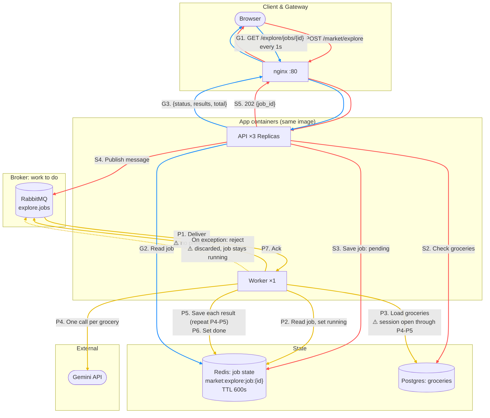

# Phase 6 Step 2 – Explore worker (V1)

```mermaid
graph TB
    subgraph edge["Client & Gateway"]
        Browser([Browser])
        Nginx["nginx :80"]
    end

    subgraph app["App containers (same image)"]
        API["API ×3 Replicas"]
        Worker["Worker ×1"]
    end

    subgraph broker["Broker: work to do"]
        RabbitMQ[("RabbitMQ<br/>explore.jobs")]
    end

    subgraph state["State"]
        Redis[("Redis: job state<br/>market:explore:job:{id}<br/>TTL 600s")]
        Postgres[("Postgres: groceries")]
    end

    subgraph external["External"]
        Gemini([Gemini API])
    end

    %% SUBMIT (edges 0-6)
    Browser -->|"S1. POST /market/explore"| Nginx
    Nginx --> API
    API -->|"S2. Check groceries"| Postgres
    API -->|"S3. Save job: pending"| Redis
    API -->|"S4. Publish message"| RabbitMQ
    API -->|"S5. 202 {job_id}"| Nginx
    Nginx --> Browser

    %% PROCESS (edges 7-13)
    RabbitMQ ==>|"P1. Deliver<br/>⚠️ no prefetch"| Worker
    Worker -->|"P2. Read job, set running"| Redis
    Worker -->|"P3. Load groceries<br/>⚠️ session open through P4-P5"| Postgres
    Worker -->|"P4. One call per grocery"| Gemini
    Worker -->|"P5. Save each result (repeat P4-P5)<br/>P6. Set done"| Redis
    Worker -->|"P7. Ack"| RabbitMQ
    Worker -.->|"On exception: reject<br/>⚠️ discarded, job stays running"| RabbitMQ

    %% POLL (edges 14-18)
    Browser -->|"G1. GET /explore/jobs/{id} every 1s"| Nginx
    Nginx --> API
    API -->|"G2. Read job"| Redis
    API -->|"G3. {status, results, total}"| Nginx
    Nginx --> Browser

    linkStyle 0,1,2,3,4,5,6 stroke:#ff4d4d,stroke-width:2px;
    linkStyle 7,8,9,10,11,12,13 stroke:#e6b800,stroke-width:2px;
    linkStyle 14,15,16,17,18 stroke:#1a8cff,stroke-width:2px;
```
